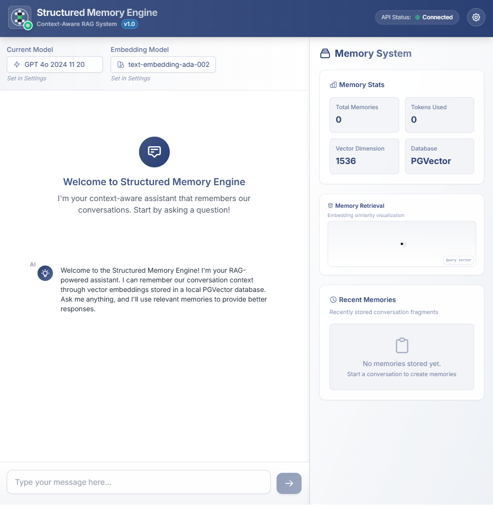
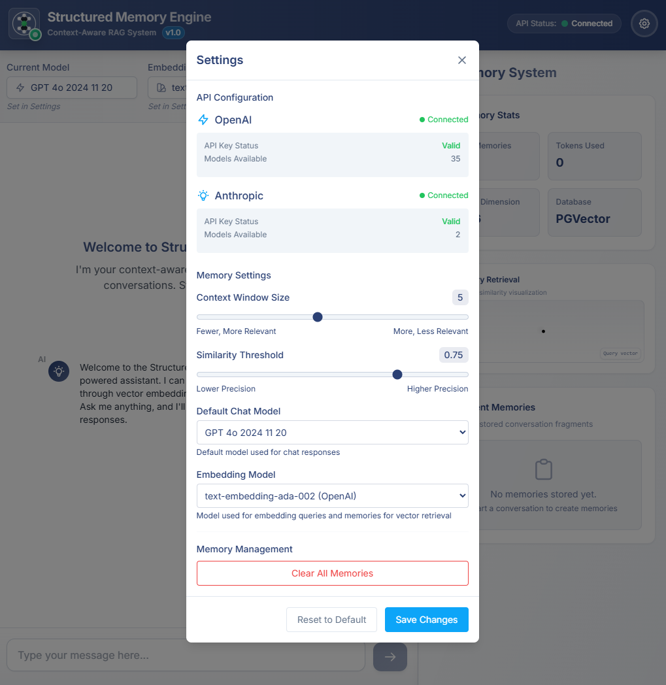
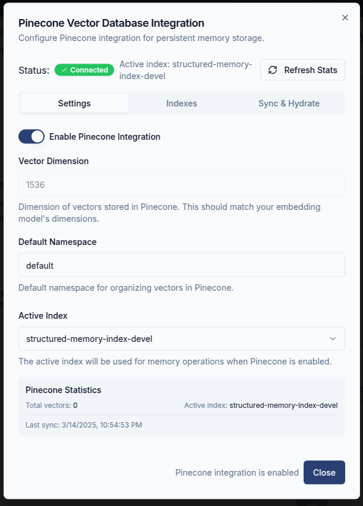
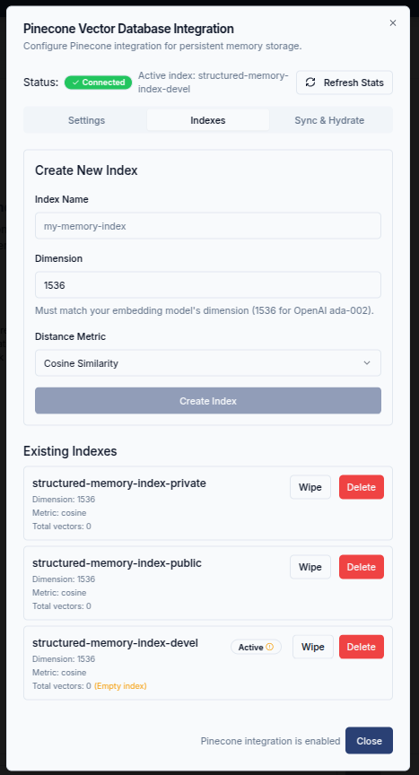
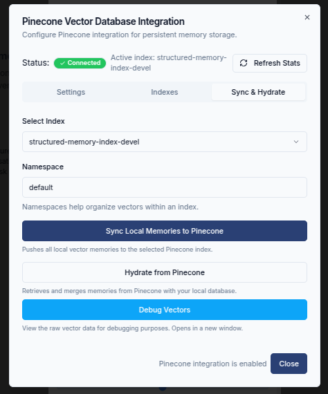
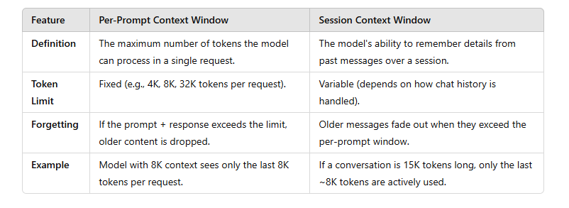

# Structured Memory Engine: Overcoming AI Chatbot Memory Limitations

## Executive Summary

The Structured Memory Engine (SME) is an experimental, open-source proof-of-concept for AI-driven conversation systems, exploring approaches to address limitations of current commercial chatbot platforms. By implementing a semantic memory architecture, SME aims to transform ephemeral interactions into persistent, contextually-aware conversational experiences. This project was developed entirely with AI assistance as an experiment in real-time context capture for RAG systems.

## Problem Statement

Modern AI-driven chatbots have made progress in conversational capabilities but still face fundamental limitations regarding context retention and memory persistence. These limitations affect their ability to deliver sustained, meaningful interactions over extended periods or across multiple sessions.

### Key Limitations of Current AI Chatbots

#### 1. Limited Context Window

Commercially available chatbot platforms such as OpenAI's GPT-4, Anthropic's Claude, or Google's Gemini maintain a fixed-size context window, typically ranging between approximately 4,000 and 32,000 tokens. Once a conversation exceeds this predefined limit, older interactions are automatically discarded, causing the chatbot to lose previously discussed context (OpenAI, 2024; Anthropic, 2024).

As OpenAI explicitly states, "ChatGPT has limited memory and will lose context from the beginning of the conversation after a certain threshold, causing it to repeat questions or lose coherence" (OpenAI Help Center, 2024). This limitation results in repetitive questions, fragmented conversational continuity, and diminished user experience.

#### 2. Lack of Persistent Cross-Session Memory

Most existing AI chat systems are inherently stateless, meaning each new user session starts fresh without referencing prior interactions unless explicitly engineered otherwise. Amazon's Bedrock AI documentation confirms this design limitation, noting that by default, conversational agents retain context only within a single session. For context to persist across sessions, developers must explicitly implement external memory management systems (Amazon Bedrock Documentation, 2023).

This inherent statelessness leads to:

- Poor user experience, due to repetitive questions and forgotten context (Humanloop, 2024).
- Operational inefficiency, as users repeatedly re-enter previously shared information.
- Limited AI adaptability and personalization, preventing chatbots from evolving based on long-term interaction history.

While frameworks such as LangChain and LlamaIndex aim to mitigate some of these challenges by adding context management layers, their complexity, ongoing maintenance overhead, and lack of structured memory management often hinder widespread adoption and practical usability (LangChain Documentation, 2024).

### The Need for Structured, Persistent AI Memory

To address these limitations, chatbots can benefit from a structured memory framework that enables context persistence across interactions, sessions, and platforms. Such an approach can improve conversational continuity, accuracy, personalization, and overall user experience.

The Structured Memory Engine (SME) was created as a proof-of-concept to explore solutions to these challenges. This experimental project, developed entirely using AI assistance, tests approaches for structured memory management to improve conversation quality and context retention across sessions.

## SME vs. Traditional RAG Systems

While Retrieval-Augmented Generation (RAG) has become a standard approach for enhancing LLMs with external knowledge, the Structured Memory Engine (SME) explores several additions to basic RAG implementations. This experimental project tests the following differences from typical RAG systems:

| Feature | Traditional RAG | Structured Memory Engine |
|---------|----------------|--------------------------|
| **Memory Persistence** | Typically stateless between sessions | Full cross-session persistence with cloud vector synchronization |
| **Context Management** | Fixed-size, recency-based context window | Dynamic, relevance-based context selection independent of recency |
| **Retrieval Mechanism** | Static similarity thresholds | Adaptive thresholds that adjust based on query classification |
| **Query Analysis** | Basic embedding similarity search | Hybrid scoring combining vector similarity with keyword matching |
| **Storage Architecture** | Single vector database | Dual-database architecture (local + cloud) with bidirectional sync |
| **Memory Visualization** | Typically absent | Real-time visualization of semantic relationships and memory retrieval |
| **Provider Integration** | Usually tied to single LLM provider | Multi-provider support with unified memory interface |

The approach in SME treats conversation history as a structured, persistent memory system rather than merely as retrieval corpus. This experimental design aims to enable progressive learning, continuity across sessions, and improved contextual awareness.

## SME Core Capabilities

- **Advanced Vector-based Memory Architecture**: Implements PostgreSQL with pgvector extension to create semantic representations of conversations, enabling precise similarity search
- **Cloud-based Persistent Memory**: Integrates with Pinecone vector database for long-term memory storage across sessions and platforms
- **Multi-modal LLM Integration**: Provides unified interface supporting multiple AI providers including OpenAI and Anthropic 
- **Semantic Context Retrieval**: Dynamically identifies and surfaces relevant historical information during ongoing conversations
- **Adaptive Threshold Technology**: Automatically adjusts similarity thresholds based on query type classification (questions vs. statements)
- **Precision Memory Configuration**: Fine-grained control over memory relevance parameters, context scope, and retrieval sensitivity
- **Memory Visualization System**: Real-time visualization of semantic relationships and memory vector space

## System Architecture and Technical Components

The Structured Memory Engine employs a sophisticated multi-tiered architecture that enables scalable, persistent memory management with real-time performance characteristics.

### Component Architecture

The system is architected as a series of interconnected layers, each providing specialized functionality:

1. **User Interface Layer**: Built with React and TypeScript, providing a responsive, intuitive interface for conversation and memory management
2. **API & Middleware Layer**: Express.js endpoints implementing RESTful interfaces for all memory and AI operations
3. **Memory Management Layer**: Specialized components for vector operations, embedding generation, and memory persistence
4. **AI Integration Layer**: Provider-agnostic interfaces supporting multiple large language model providers
5. **Storage Layer**: Dual-database architecture combining local vector storage with cloud-based persistent memory

### Core Technology Stack

The system utilizes the following technologies across its implementation:

- **Frontend Technologies**:
  - React 18+ with TypeScript for type-safe component development
  - TailwindCSS with Shadcn UI component system for responsive interface design
  - React Query for efficient state management and API integration

- **Backend Framework**:
  - Node.js with Express for high-performance API endpoints
  - PostgreSQL with pgvector extension providing efficient vector operations
  - Drizzle ORM for type-safe database interaction

- **AI Integration**:
  - OpenAI and Anthropic API integrations with unified interface
  - OpenAI text-embedding-3-small model for vector embeddings
  - Vector similarity search algorithms for memory retrieval

- **Vector Database Technologies**:
  - Local pgvector-powered database for high-performance retrieval
  - Pinecone vector database integration for long-term memory persistence
  - Multi-index memory organization

## Visual System Overview

The following visuals demonstrate the system's interface and key components:

### Integrated Chat Interface with Memory Panel

  
  
<em>The primary user interface incorporates both conversation interaction and memory visualization, with contextual retrieval capabilities.</em>

### Memory Configuration System

  
  
<em>The advanced configuration panel enables precise control over memory parameters, AI provider selection, and similarity thresholds.</em>

### Cloud-based Vector Memory Integration

  
  
<em>The vector database integration panel provides configuration for persistent memory storage across sessions and platforms.</em>

### Vector Index Management Interface

  
  
<em>The index management system enables creation and organization of vector collections with dimension and similarity metric configuration.</em>

### Memory Synchronization and Migration Tools

  
  
<em>Bidirectional synchronization between local and cloud vector databases ensures memory persistence and availability.</em>

## Technical Implementation and Methodology

The Structured Memory Engine employs a sophisticated multi-layered approach to memory management and contextual understanding:

### Memory Creation and Storage Process

1. **Semantic Embedding Generation**: User queries and AI responses undergo advanced processing through state-of-the-art embedding models, converting natural language into high-dimensional vector representations that capture semantic meaning.

2. **Dual-Database Architecture**: The system implements a two-tier storage approach:
   - **Local Vector Store**: PostgreSQL with pgvector extension provides high-performance, low-latency access to recent interactions
   - **Cloud-based Long-term Memory**: Pinecone vector database integration enables persistent storage and retrieval of historical conversations across sessions and platforms

3. **Adaptive Context Window Management**: Unlike fixed-context systems, SME dynamically manages memory using semantic relevance rather than recency, ensuring the most important information is preserved regardless of conversation length.

### Contextual Retrieval Mechanism

The SME implements an experimental hybrid retrieval approach that combines:

1. **Dynamic Query Analysis**: Incoming queries are algorithmically classified as questions or statements, with different retrieval parameters applied to each type
   
2. **Similarity Threshold Adaptation**: The system dynamically adjusts similarity thresholds based on query type, conversation history, and user behavior patterns

3. **Hybrid Scoring Algorithm**: Retrieved memories are ranked using an algorithm combining vector similarity with keyword matching and relevance scoring

### Enhanced Response Generation

The multi-stage response generation process ensures AI outputs are contextually grounded and informationally rich:

1. **Context Augmentation**: The most relevant memories are selectively incorporated into the AI prompt
2. **Provider-Agnostic Integration**: A unified interface allows seamless switching between OpenAI and Anthropic models while maintaining consistent memory access
3. **Feedback Loop Integration**: User interactions implicitly refine memory relevance scoring over time

## Data Reconciliation and Deduplication System

The Structured Memory Engine implements a data reconciliation and deduplication system to ensure memory consistency across local and cloud databases. This system prevents memory duplication and optimizes storage efficiency without requiring manual intervention.

### Key Features of the Deduplication System

#### Consistent Hash-based Memory Identification

The system uses a hashing mechanism to generate unique identifiers for each memory:

- Each memory is assigned a hash-based ID derived from its content and type
- The `memoryIdForUpsert()` function normalizes content by trimming and lowercasing before hashing
- The SHA-256 hash algorithm generates a consistent identifier regardless of where the memory is created
- By excluding timestamp and database ID from the hash calculation, identical content always produces the same identifier

#### Bidirectional Synchronization with Deduplication

During synchronization between local pgvector and cloud Pinecone databases:

1. **Pre-synchronization Duplicate Detection**:
   - Before uploading vectors, the system queries Pinecone to identify existing identical memories
   - A map of existing memory IDs is created to track potential duplicates
   - Content fingerprinting prevents re-uploading semantically identical memories

2. **Batch Processing with Deduplication**:
   - Memories are processed in configurable batches (default: 100) to optimize API usage
   - Each batch is checked against existing vectors to avoid duplicate uploads
   - When identical hash matches are found, the system defaults to overwriting the existing record with the new data
   - The system tracks and reports deduplication rates for monitoring

3. **Hydration with Duplicate Prevention**:
   - When retrieving memories from Pinecone to the local database, the system checks for duplicates
   - Local database hashes are compared with incoming vector IDs to prevent redundant storage
   - Statistics track duplicate detection rates during both sync and hydration operations

#### Deduplication Metrics

The system maintains metrics for deduplication:

- **Sync Deduplication Rate**: Percentage of duplicates detected when sending local memories to Pinecone
- **Hydration Deduplication Rate**: Percentage of duplicates detected when retrieving memories from Pinecone
- **Average Deduplication Rate**: Combined metric showing overall system efficiency
- **Performance Tracking**: UI displays vector counts, operation success rates, and processing timestamps

### Benefits of Automatic Deduplication

1. **Reduced Storage Usage**: Preventing duplicate memories minimizes vector database storage requirements
2. **Improved Query Performance**: Fewer redundant vectors lead to faster retrieval
3. **Data Consistency**: Maintains consistent memory representation across local and cloud environments
4. **No Manual Maintenance**: The system handles deduplication automatically
5. **Handles Growing Datasets**: The approach maintains performance as the dataset grows

## Implementation Guidelines

The following technical requirements should be considered:

### System Requirements

- **Server Environment**: Node.js v18+ 
- **Database Infrastructure**: PostgreSQL 14+ with pgvector extension
- **API Integration**: OpenAI API key and/or Anthropic API key
- **Vector Database**: Pinecone account for persistent memory storage

### Environment Configuration

The following environment variables are essential for proper system operation:

| Variable | Description | 
|----------|-------------|
| `DATABASE_URL` | PostgreSQL connection string |
| `OPENAI_API_KEY` | OpenAI API key for embedding generation and response |
| `ANTHROPIC_API_KEY` | Anthropic API key for alternative model access |
| `PINECONE_API_KEY` | Pinecone API key for cloud vector storage |

### Security Considerations

When implementing this system consider these security best practices:

1. Always use HTTPS in production
2. Store API keys and secrets securely using environment variables or a secrets manager
3. Implement rate limiting for API endpoints
4. Configure CORS settings to restrict access to your backend
5. Regularly update dependencies to patch security vulnerabilities

## Future Roadmap

The Structured Memory Engine is under active development, with several key enhancements planned for future releases:

### Internet Search Agent

A dedicated agent module that will enable the system to dynamically retrieve and incorporate real-time information from internet sources, supplementing the conversation with up-to-date facts and data beyond the existing memory store. This will allow the system to address queries requiring current information while maintaining context awareness through the existing memory architecture.

### Multi-Namespace Support

Enhanced memory organization through hierarchical namespace management, allowing:
- Segmentation of memories by topic, domain, or user-defined categories
- Parallel querying across multiple namespaces with configurable priority weighting
- Improved privacy controls with namespace-level access permissions
- Dynamic namespace creation based on conversation analysis

### File Upload and Document Processing

A comprehensive document processing pipeline that will:
- Support multiple file formats (PDF, DOCX, TXT, etc.)
- Extract text and structured data from uploaded documents
- Automatically summarize document content for efficient storage
- Create semantic embeddings of document segments for context retrieval
- Link document knowledge with conversational memory

### Prompt and Query Optimization

Extensive prompt engineering improvements focusing on:
- Fine-tuned prompts for different interaction types and contexts
- Dynamic query reformulation for improved memory retrieval
- Context-aware prompt templates with parameter optimization
- A/B testing framework for prompt performance evaluation
- Automated prompt parameter tuning based on user interaction data

### References

1. OpenAI. (2024). ChatGPT: Optimizing Language Models for Dialogue. OpenAI Technical Documentation.
2. Anthropic. (2024). Claude Technical Documentation: Context Window Limitations. Anthropic Developer Hub.
3. Amazon. (2023). Bedrock AI Documentation: Memory Management in Conversational Agents. AWS Technical Library.
4. Humanloop. (2024). Practical Limitations of LLM Conversation Agents. Whitepaper Series.
5. LangChain Documentation. (2024). Memory Components and Context Preservation. LangChain Technical Library.

## Appendix: Context Window in AI Systems

### Per-Prompt Context Window vs. Session Context Window in an AI Chatbot

When discussing AI chatbots, especially large language models (LLMs) like ChatGPT or Claude, the context window refers to the amount of text (tokens) the model can "remember" and process at a given time. Understanding the distinction between these two types of context windows is crucial for grasping the benefits of the Structured Memory Engine.

#### 1. Per-Prompt Context Window

This refers to the maximum number of tokens (words, punctuation, and spaces included) that the model can process within a single request (prompt + response).

- Every time you send a message, the model processes your input and generates a response within a fixed token limit (e.g., 4K, 8K, 32K tokens, depending on the model version).
- If your input exceeds this limit, older parts may get truncated (removed from memory) before processing.
- This limit includes both your message and the AI's response, meaning long responses may limit how much input can be considered.

**Example:**
- If an AI model has an 8K-token context window:
- You send a 5K-token prompt.
- The AI can generate up to 3K tokens before hitting the limit.

#### 2. Session Context Window

A session context window refers to how much of the ongoing conversation the chatbot retains.

- Some chatbots try to simulate memory across multiple prompts by summarizing or selectively retaining key details from previous messages.
- However, at any given moment, the active memory of the model is still bound by the per-prompt context window.

**How It Works in a Session:**
- As a conversation continues, earlier messages might fall out of the model's context window and be forgotten.
- If a model has a 4K-token context limit, and your conversation grows to 10K tokens, only the most recent 4K tokens (or a compressed summary) are retained.

**Example:**
- You have a long conversation spanning 15 messages totaling 10K tokens.
- If the model's limit is 4K tokens, only the most recent or most relevant 4K tokens (from both user and AI) are used.

#### Key Differences

  
  
<em>Comparison of Per-Prompt Context Window vs. Session Context Window characteristics</em>

#### Implications for AI Chatbots

- If you want the model to "remember" key details, you may need to restate important context periodically.
- Some AI chatbots use summarization techniques to keep relevant details from earlier messages within the window.
- A larger per-prompt context window helps retain more history, but does not create long-term memory—it's just a larger temporary workspace.

#### How SME Addresses These Limitations

The Structured Memory Engine addresses the fundamental limitations of traditional context windows by:

1. **Persistent Vector Memory**: Storing all interactions as semantic vectors that persist beyond the session
2. **Semantic Retrieval**: Dynamically retrieving only the most relevant memories based on the current query
3. **Unlimited Effective Context**: Breaking free from token limits by maintaining a searchable memory bank that spans all previous interactions
4. **Cross-Session Continuity**: Enabling conversations to pick up where they left off, even after weeks or months
5. **Selective Memory Injection**: Including only the most relevant historical context in each prompt, optimizing token usage

## License and Attribution

This project is licensed under the MIT License - see the LICENSE file for details.