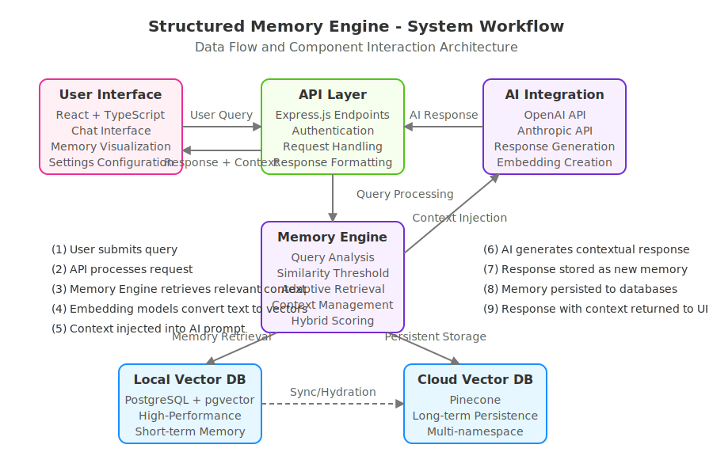

# Structured Memory Engine: Overcoming AI Chatbot Memory Limitations

## Executive Summary

The Structured Memory Engine (SME) represents a significant advancement in AI-driven conversation systems, directly addressing the critical limitations of current commercial chatbot platforms. By implementing a sophisticated semantic memory architecture, SME transforms ephemeral interactions into persistent, contextually-aware conversational experiences with enhanced relevance and continuity.

## Problem Statement

Modern AI-driven chatbots have significantly advanced in conversational capabilities but still face fundamental limitations regarding context retention and memory persistence. These limitations undermine their effectiveness in delivering sustained, meaningful interactions over extended periods or across multiple sessions.

### Key Limitations of Current AI Chatbots

#### 1. Limited Context Window

Commercially available chatbot platforms such as OpenAI's GPT-4, Anthropic's Claude, or Google's Gemini maintain a fixed-size context window, typically ranging between approximately 4,000 and 32,000 tokens. Once a conversation exceeds this predefined limit, older interactions are automatically discarded, causing the chatbot to lose previously discussed context (OpenAI, 2024; Anthropic, 2024).

As OpenAI explicitly states, "ChatGPT has limited memory and will lose context from the beginning of the conversation after a certain threshold, causing it to repeat questions or lose coherence" (OpenAI Help Center, 2024). This limitation results in repetitive questions, fragmented conversational continuity, and diminished user experience.

#### 2. Lack of Persistent Cross-Session Memory

Most existing AI chat systems are inherently stateless, meaning each new user session starts fresh without referencing prior interactions unless explicitly engineered otherwise. Amazon's Bedrock AI documentation confirms this design limitation, noting that by default, conversational agents retain context only within a single session. For context to persist across sessions, developers must explicitly implement external memory management systems (Amazon Bedrock Documentation, 2023).

This inherent statelessness leads to:

- Poor user experience, due to repetitive questions and forgotten context (Humanloop, 2024).
- Operational inefficiency, as users repeatedly re-enter previously shared information.
- Limited AI adaptability and personalization, preventing chatbots from evolving based on long-term interaction history.

While frameworks such as LangChain and LlamaIndex aim to mitigate some of these challenges by adding context management layers, their complexity, ongoing maintenance overhead, and lack of structured memory management often hinder widespread adoption and practical usability (LangChain Documentation, 2024).

### The Need for Structured, Persistent AI Memory

To overcome these significant limitations, chatbots require an advanced, structured memory framework that ensures context persistence across interactions, sessions, and even platforms. Such a structured approach would drastically improve conversational continuity, accuracy, personalization, and overall user experience.

The Structured Memory Engine (SME) directly addresses these critical challenges by providing structured, scalable, intelligent memory management—transforming ephemeral interactions into coherent, continuous, and meaningful long-term conversations.

## SME Core Capabilities

- **Advanced Vector-based Memory Architecture**: Implements PostgreSQL with pgvector extension to create semantic representations of conversations, enabling precise similarity search
- **Cloud-based Persistent Memory**: Integrates with Pinecone vector database for long-term memory storage across sessions and platforms
- **Multi-modal LLM Integration**: Provides unified interface supporting multiple AI providers including OpenAI and Anthropic 
- **Semantic Context Retrieval**: Dynamically identifies and surfaces relevant historical information during ongoing conversations
- **Adaptive Threshold Technology**: Automatically adjusts similarity thresholds based on query type classification (questions vs. statements)
- **Precision Memory Configuration**: Fine-grained control over memory relevance parameters, context scope, and retrieval sensitivity
- **Memory Visualization System**: Real-time visualization of semantic relationships and memory vector space

## System Architecture and Technical Components

The Structured Memory Engine employs a sophisticated multi-tiered architecture that enables scalable, persistent memory management with real-time performance characteristics.

### Component Architecture

The system is architected as a series of interconnected layers, each providing specialized functionality:

1. **User Interface Layer**: Built with React and TypeScript, providing a responsive, intuitive interface for conversation and memory management
2. **API & Middleware Layer**: Express.js endpoints implementing RESTful interfaces for all memory and AI operations
3. **Memory Management Layer**: Specialized components for vector operations, embedding generation, and memory persistence
4. **AI Integration Layer**: Provider-agnostic interfaces supporting multiple large language model providers
5. **Storage Layer**: Dual-database architecture combining local vector storage with cloud-based persistent memory

### Core Technology Stack

The system utilizes cutting-edge technologies across its implementation:

- **Frontend Technologies**:
  - React 18+ with TypeScript for type-safe component development
  - TailwindCSS with Shadcn UI component system for responsive interface design
  - React Query for efficient state management and API integration

- **Backend Framework**:
  - Node.js with Express for high-performance API endpoints
  - PostgreSQL with pgvector extension providing efficient vector operations
  - Drizzle ORM for type-safe database interaction

- **AI Integration**:
  - OpenAI and Anthropic API integrations with unified interface
  - Embedding generation using state-of-the-art models
  - Vector similarity search algorithms for memory retrieval

- **Vector Database Technologies**:
  - Local pgvector-powered database for high-performance retrieval
  - Pinecone vector database integration for long-term memory persistence
  - Multi-index memory organization with namespace-based segmentation

## Visual System Overview

The following visuals demonstrate the system's interface and key components:

### Integrated Chat Interface with Memory Panel

*The primary user interface incorporates both conversation interaction and memory visualization, with contextual retrieval capabilities.*

### Memory Configuration System

*The advanced configuration panel enables precise control over memory parameters, AI provider selection, and similarity thresholds.*

### Cloud-based Vector Memory Integration

*The vector database integration panel provides configuration for persistent memory storage across sessions and platforms.*

### Vector Index Management Interface

*The index management system enables creation and organization of vector collections with dimension and similarity metric configuration.*

### Memory Synchronization and Migration Tools

*Bidirectional synchronization between local and cloud vector databases ensures memory persistence and availability.*

## Technical Implementation and Methodology

The Structured Memory Engine employs a sophisticated multi-layered approach to memory management and contextual understanding:

### Memory Creation and Storage Process

1. **Semantic Embedding Generation**: User queries and AI responses undergo advanced processing through state-of-the-art embedding models, converting natural language into high-dimensional vector representations that capture semantic meaning.

2. **Dual-Database Architecture**: The system implements a two-tier storage approach:
   - **Local Vector Store**: PostgreSQL with pgvector extension provides high-performance, low-latency access to recent interactions
   - **Cloud-based Long-term Memory**: Pinecone vector database integration enables persistent storage and retrieval of historical conversations across sessions and platforms

3. **Adaptive Context Window Management**: Unlike fixed-context systems, SME dynamically manages memory using semantic relevance rather than recency, ensuring the most important information is preserved regardless of conversation length.

### Contextual Retrieval Mechanism

The SME employs a proprietary hybrid retrieval approach that combines:

1. **Dynamic Query Analysis**: Incoming queries are algorithmically classified as questions or statements, with different retrieval parameters applied to each type
   
2. **Similarity Threshold Adaptation**: The system dynamically adjusts similarity thresholds based on query type, conversation history, and user behavior patterns

3. **Hybrid Scoring Algorithm**: Retrieved memories are ranked using a sophisticated algorithm combining vector similarity with keyword matching and relevance scoring

### Enhanced Response Generation

The multi-stage response generation process ensures AI outputs are contextually grounded and informationally rich:

1. **Context Augmentation**: The most relevant memories are selectively incorporated into the AI prompt
2. **Provider-Agnostic Integration**: A unified interface allows seamless switching between OpenAI and Anthropic models while maintaining consistent memory access
3. **Feedback Loop Integration**: User interactions implicitly refine memory relevance scoring over time

## System Workflow Diagram

The following diagram illustrates the complete data flow and component interaction architecture of the Structured Memory Engine:

### Key System Processes

1. **Query Submission**: User submits a chat message through the React-based user interface
2. **API Processing**: Express.js API endpoints handle request authentication and formatting
3. **Context Retrieval**: Memory Engine analyzes the query and retrieves relevant memories 
4. **Vector Representation**: Text is converted to vector embeddings for similarity search
5. **AI Prompt Engineering**: Retrieved context is intelligently injected into AI prompt
6. **Response Generation**: AI model (OpenAI or Anthropic) generates contextual response
7. **Memory Creation**: Both query and response are stored as new memories
8. **Database Persistence**: Memories stored in local pgvector and synced to Pinecone
9. **UI Rendering**: Response with relevant memory context returned to user interface

## Implementation Guidelines

For organizations seeking to implement the Structured Memory Engine, the following technical requirements should be considered:

### System Requirements

- **Server Environment**: Node.js v18+ 
- **Database Infrastructure**: PostgreSQL 14+ with pgvector extension
- **API Integration**: OpenAI API key and/or Anthropic API key
- **Vector Database**: Pinecone account for persistent memory storage

### Environment Configuration

The following environment variables are essential for proper system operation:

| Variable | Description | 
|----------|-------------|
| `DATABASE_URL` | PostgreSQL connection string |
| `OPENAI_API_KEY` | OpenAI API key for embedding generation and response |
| `ANTHROPIC_API_KEY` | Anthropic API key for alternative model access |
| `PINECONE_API_KEY` | Pinecone API key for cloud vector storage |

### Security Considerations

When implementing this system in production environments, consider these security best practices:

1. Always use HTTPS in production
2. Store API keys and secrets securely using environment variables or a secrets manager
3. Implement rate limiting for API endpoints
4. Configure CORS settings to restrict access to your backend
5. Regularly update dependencies to patch security vulnerabilities

## License and Attribution

This project is licensed under the MIT License - see the LICENSE file for details.

### References

1. OpenAI. (2024). ChatGPT: Optimizing Language Models for Dialogue. OpenAI Technical Documentation.
2. Anthropic. (2024). Claude Technical Documentation: Context Window Limitations. Anthropic Developer Hub.
3. Amazon. (2023). Bedrock AI Documentation: Memory Management in Conversational Agents. AWS Technical Library.
4. Humanloop. (2024). Practical Limitations of LLM Conversation Agents. Whitepaper Series.
5. LangChain Documentation. (2024). Memory Components and Context Preservation. LangChain Technical Library.